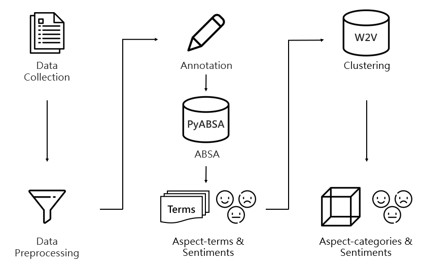

# Exploring Factors of Restaurant Experience by ABSA

This project is a practice of aspect-based sentiment analysis (ABSA). ABSA is a fine-grained method of sentiment analysis, which can extract multiple aspect-sentiment pairs from one sentence.

The project aimed to extract people's sentiments on New York City restaurant, and the aspects that cause these sentiments, by analyzing reviews on Google Maps. The project used a Python package [pyABSA](https://github.com/yangheng95/PyABSA) to conduct ABSA. As a result, review texts from Google Maps were first been collected, training dataset were then be created using these reviews.

ABSA model was trained and performed prediction on the predicting dataset, aspect-terms and setiments were extracted. The aspect-terms were then clustered into groups (aspect-categories) using an word embedding model [word2vec](https://radimrehurek.com/gensim/models/word2vec.html).

Here is the general process of the project:




## Table of Contents

- [Installation](#installation)
- [Usage](#usage)
- [License](#license)

## Installation

1. Clone the project
   ```sh
   git clone 
   ```
2. Install related packages
   ```sh
   pip install -r requirements.txt
   ```

## Usage

### Data colletion:
Using [Playwright](https://playwright.dev/python/). You can change parameters `place`,`query` in `crawler.py` for your customized search.
### Preprocessing:
The project did the following:
* Replace every line break with space.
* Remove emoji.
* Remove reviews under 2 tokens.
* Review reviews that are non-english or no alphabets.

### Make dataset:
For instruction of making customized annotated (training, testing, validation) datasets, please refer to [pyABSA](https://github.com/yangheng95/PyABSA).

### Integrated datasets:
Dataset `105.Google_Maps_easy` is a dataset created by me for pyABSA model training. The samples were created from New York City restaurant reviews on Google Maps.

Dataset description:

| Dataset    | Reviews | Aspects | Positive | Negative | Neutral |
|------------|---------|---------|----------|----------|---------|
| Training   | 600     | 1787    | 1276     | 347      | 164     |
| Validation | 200     | 670     | 499      | 105      | 66      |
| Testing    | 200     | 563     | 401      | 112      | 50      |

## License

[](https://opensource.org/licenses/MIT)